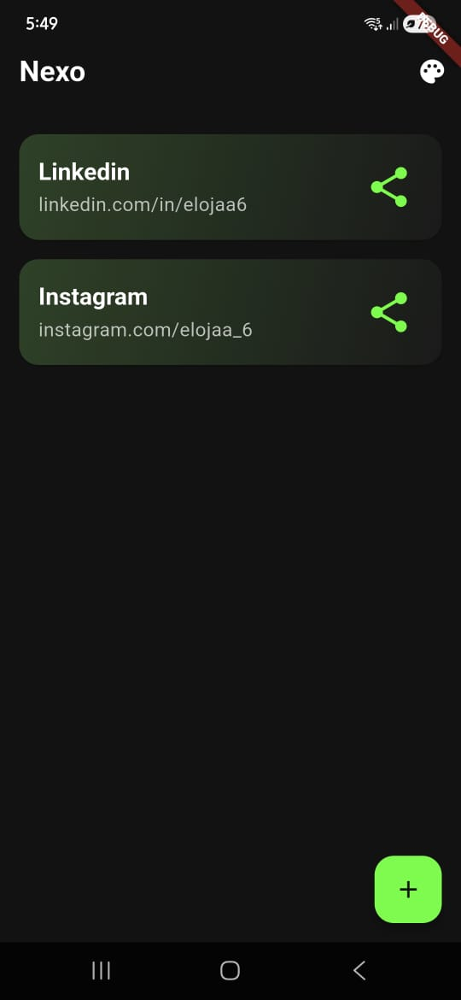

# Nexo - Link Management App 🔗

A sleek and modern link management application built with Flutter. This project was developed to practice and showcase advanced UI skills, a premium dark mode aesthetic, and a clean, scalable architecture.

<!-- You can add a GIF or screenshots of your app here -->
<p align="center">
  
</p>


## ✨ Features

- **Add, Edit, and Delete Links:** Easily manage your collection of links.
- **Reorder Links:** Organize your links with a simple drag-and-drop interface.
- **QR Code Generation:** Instantly generate a QR code for any link using `qr_flutter`.
- **Share Links:** Share your links with other apps via the native platform share sheet using `share_plus`.
- **Local Persistence:** All your links are saved securely on your device using the `drift` database.
- **Premium Dark Mode:** Aesthetically pleasing dark UI with custom gradients and neon accents.

## 🏛️ Architecture & Tech Stack

This project is built with a focus on clean, scalable, and maintainable code, following Clean Architecture principles.

- **Architecture:** Clean Architecture (Domain, Data, Presentation layers).
- **State Management:** `flutter_bloc` for predictable and robust state management.
- **Navigation:** `go_router` for a declarative, URL-based routing solution.
- **Local Database:** `drift` (formerly Moor) for a reactive persistence library built on top of SQLite.
- **Dependency Injection:** `get_it` and `injectable` for managing dependencies and decoupling components.
- **Data Modeling:** `freezed` for immutable, boilerplate-free data classes and BLoC states.
- **Value Equality:** `freezed` also handles `==` and `hashCode` overrides automatically.
- **Local Storage:** `shared_preferences` for simple key-value data.

## 🚀 Getting Started

To get a local copy up and running, follow these simple steps.

### Prerequisites

Make sure you have the Flutter SDK installed on your machine. You can find installation instructions on the official Flutter website.

### Installation

1.  **Clone the repository:**

    ```sh
    git clone https://github.com/elojaa6/Nexus.git
    cd nexo
    ```

2.  **Install dependencies:**

    ```sh
    flutter pub get
    ```

3.  **Run the code generator:**
    This project uses code generation for dependency injection, data classes, and the database. Run the following command to generate the necessary files:

    ```sh
    flutter pub run build_runner build --delete-conflicting-outputs
    ```

4.  **Run the app:**
    ```sh
    flutter run
    ```

## 📄 License

This project is open source. Feel free to use the code as you see fit. Consider adding a license like MIT if you wish.

---

Feel free to reach out if you have any questions or want to connect!
